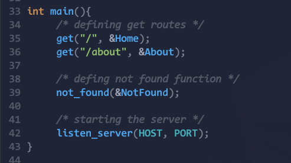
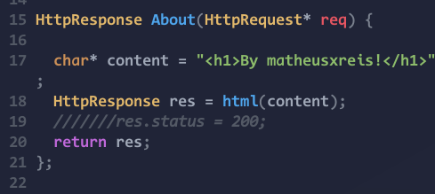
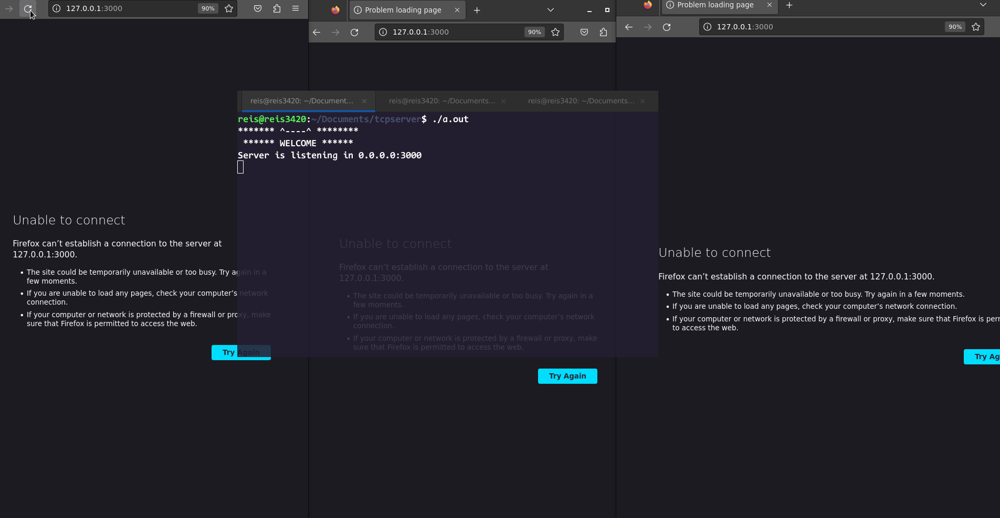
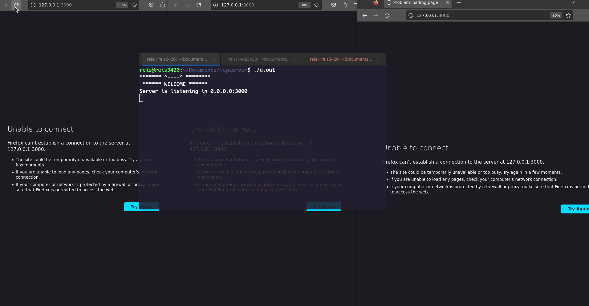

# Multithreading HTTP server in C

A no so complex http server done in C language. 

This server:
 - Listening TCP connections;
 - has HTTP protocol implementation;
 - has functions and structs that abstract and handle request and response;
 - Handling multiple requests throught a multithreading processing; 
 

### The final view got this way:

The programmer only pass the PORT and HOST in listen function, and create the routes throught get, post, put and delete functions. Each method function receive a path and a callback, which must receive a request and return a response.

### Multithreading vs Singlethreading:

Multithreading        |  Singlethreading
:-------------------------:|:-------------------------:
 | 

That's all folks!

